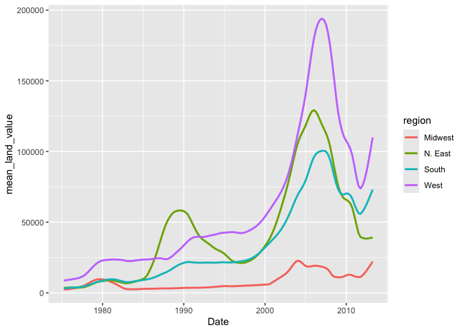
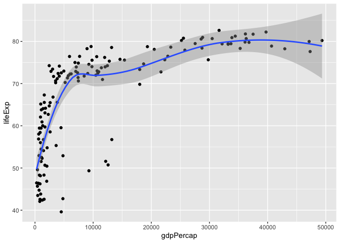

# assignment_5.qmd


# Assignment 5: Data transformation and visualization - Part 2

<br>

## Instructions: Please read through this before you begin

-   This assignment is due by **10pm on Thursday 10/02/2025**. Please
    upload it using your personal GitHub repository for this class.

-   Please name your Quarto file `assignment_5.qmd` and the rendered
    markdown file `assignment_5.md`.

-   For this assignment, please **reproduce this markdown file** using R
    markdown. This includes the followings:

    -   **Reproduce this markdown template**, except for this list of
        instructions which you **don’t** have to include. Pay attention
        to all the formatting in this file, including bullet points,
        bolded characters, inserted code chunks, headings, text colors,
        blank lines, etc.

    -   Have all your code embedded within the R markdown file, and show
        **BOTH your code and plots** in the knitted markdown file.

    -   When a verbal response is needed, answer by editing the part in
        the R markdown template where it says “Write your response
        here”.

    -   Use R Markdown functionalities to **hide messages and warnings
        when needed**. (Suggestion: messages and warnings can often be
        informative and important, so please examine them carefully and
        only turn them off when you finish the exercise).

-   Please note that Questions 2.8-2.11 are **optional**.

<br>

First, load all the required packages with the following code. Install
them if they are not installed yet.

``` r
library(tidyverse)
library(knitr)
library(gapminder)
```

<br>

``` r
library(tidyverse)
```

    ── Attaching core tidyverse packages ──────────────────────── tidyverse 2.0.0 ──
    ✔ dplyr     1.1.4     ✔ readr     2.1.5
    ✔ forcats   1.0.0     ✔ stringr   1.5.1
    ✔ ggplot2   3.5.2     ✔ tibble    3.3.0
    ✔ lubridate 1.9.4     ✔ tidyr     1.3.1
    ✔ purrr     1.1.0     
    ── Conflicts ────────────────────────────────────────── tidyverse_conflicts() ──
    ✖ dplyr::filter() masks stats::filter()
    ✖ dplyr::lag()    masks stats::lag()
    ℹ Use the conflicted package (<http://conflicted.r-lib.org/>) to force all conflicts to become errors

``` r
library(knitr)
library(gapminder) ##install.packages(gapminder)
```

## Exercise 1. Trends in land value

This excercise uses a dataset that describes the trends in land value
(`Land.Value`), among other variables, in different states in the US
1975-2013. The states are grouped into four different regions, under the
variable `region`. This dataset was obtained from the Data Science
Services of Harvard University.

``` r
housing <- read_csv("https://raw.githubusercontent.com/nt246/NTRES-6100-data-science/master/datasets/landdata_states.csv")
```

    Rows: 7803 Columns: 11
    ── Column specification ────────────────────────────────────────────────────────
    Delimiter: ","
    chr (2): State, region
    dbl (9): Date, Home.Value, Structure.Cost, Land.Value, Land.Share..Pct., Hom...

    ℹ Use `spec()` to retrieve the full column specification for this data.
    ℹ Specify the column types or set `show_col_types = FALSE` to quiet this message.

``` r
housing %>%
  head() %>% 
  kable() 
```

<table style="width:100%;">
<colgroup>
<col style="width: 5%" />
<col style="width: 5%" />
<col style="width: 6%" />
<col style="width: 9%" />
<col style="width: 12%" />
<col style="width: 9%" />
<col style="width: 14%" />
<col style="width: 14%" />
<col style="width: 14%" />
<col style="width: 4%" />
<col style="width: 4%" />
</colgroup>
<thead>
<tr>
<th style="text-align: left;">State</th>
<th style="text-align: left;">region</th>
<th style="text-align: right;">Date</th>
<th style="text-align: right;">Home.Value</th>
<th style="text-align: right;">Structure.Cost</th>
<th style="text-align: right;">Land.Value</th>
<th style="text-align: right;">Land.Share..Pct.</th>
<th style="text-align: right;">Home.Price.Index</th>
<th style="text-align: right;">Land.Price.Index</th>
<th style="text-align: right;">Year</th>
<th style="text-align: right;">Qrtr</th>
</tr>
</thead>
<tbody>
<tr>
<td style="text-align: left;">AK</td>
<td style="text-align: left;">West</td>
<td style="text-align: right;">2010.25</td>
<td style="text-align: right;">224952</td>
<td style="text-align: right;">160599</td>
<td style="text-align: right;">64352</td>
<td style="text-align: right;">28.6</td>
<td style="text-align: right;">1.481</td>
<td style="text-align: right;">1.552</td>
<td style="text-align: right;">2010</td>
<td style="text-align: right;">1</td>
</tr>
<tr>
<td style="text-align: left;">AK</td>
<td style="text-align: left;">West</td>
<td style="text-align: right;">2010.50</td>
<td style="text-align: right;">225511</td>
<td style="text-align: right;">160252</td>
<td style="text-align: right;">65259</td>
<td style="text-align: right;">28.9</td>
<td style="text-align: right;">1.484</td>
<td style="text-align: right;">1.576</td>
<td style="text-align: right;">2010</td>
<td style="text-align: right;">2</td>
</tr>
<tr>
<td style="text-align: left;">AK</td>
<td style="text-align: left;">West</td>
<td style="text-align: right;">2009.75</td>
<td style="text-align: right;">225820</td>
<td style="text-align: right;">163791</td>
<td style="text-align: right;">62029</td>
<td style="text-align: right;">27.5</td>
<td style="text-align: right;">1.486</td>
<td style="text-align: right;">1.494</td>
<td style="text-align: right;">2009</td>
<td style="text-align: right;">3</td>
</tr>
<tr>
<td style="text-align: left;">AK</td>
<td style="text-align: left;">West</td>
<td style="text-align: right;">2010.00</td>
<td style="text-align: right;">224994</td>
<td style="text-align: right;">161787</td>
<td style="text-align: right;">63207</td>
<td style="text-align: right;">28.1</td>
<td style="text-align: right;">1.481</td>
<td style="text-align: right;">1.524</td>
<td style="text-align: right;">2009</td>
<td style="text-align: right;">4</td>
</tr>
<tr>
<td style="text-align: left;">AK</td>
<td style="text-align: left;">West</td>
<td style="text-align: right;">2008.00</td>
<td style="text-align: right;">234590</td>
<td style="text-align: right;">155400</td>
<td style="text-align: right;">79190</td>
<td style="text-align: right;">33.8</td>
<td style="text-align: right;">1.544</td>
<td style="text-align: right;">1.885</td>
<td style="text-align: right;">2007</td>
<td style="text-align: right;">4</td>
</tr>
<tr>
<td style="text-align: left;">AK</td>
<td style="text-align: left;">West</td>
<td style="text-align: right;">2008.25</td>
<td style="text-align: right;">233714</td>
<td style="text-align: right;">157458</td>
<td style="text-align: right;">76256</td>
<td style="text-align: right;">32.6</td>
<td style="text-align: right;">1.538</td>
<td style="text-align: right;">1.817</td>
<td style="text-align: right;">2008</td>
<td style="text-align: right;">1</td>
</tr>
</tbody>
</table>

``` r
housing <- read_csv("https://raw.githubusercontent.com/nt246/NTRES-6100-data-science/master/datasets/landdata_states.csv")
housing %>%
  head() %>% 
  kable() 
```

<table style="width:99%;">
<colgroup>
<col style="width: 9%" />
<col style="width: 9%" />
<col style="width: 9%" />
<col style="width: 9%" />
<col style="width: 9%" />
<col style="width: 9%" />
<col style="width: 9%" />
<col style="width: 9%" />
<col style="width: 9%" />
<col style="width: 9%" />
<col style="width: 9%" />
</colgroup>
<thead>
<tr>
<th style="text-align: left;">
<p>
State
</p>
</th>
<th style="text-align: left;">
<p>
region
</p>
</th>
<th style="text-align: right;">
<p>
Date
</p>
</th>
<th style="text-align: right;">
<p>
Home.Value
</p>
</th>
<th style="text-align: right;">
<p>
Structure.Cost
</p>
</th>
<th style="text-align: right;">
<p>
Land.Value
</p>
</th>
<th style="text-align: right;">
<p>
Land.Share..Pct.
</p>
</th>
<th style="text-align: right;">
<p>
Home.Price.Index
</p>
</th>
<th style="text-align: right;">
<p>
Land.Price.Index
</p>
</th>
<th style="text-align: right;">
<p>
Year
</p>
</th>
<th style="text-align: right;">
<p>
Qrtr
</p>
</th>
</tr>
</thead>
<tbody>
<tr>
<td style="text-align: left;">
<p>
AK
</p>
</td>
<td style="text-align: left;">
<p>
West
</p>
</td>
<td style="text-align: right;">
<p>
2010.25
</p>
</td>
<td style="text-align: right;">
<p>
224952
</p>
</td>
<td style="text-align: right;">
<p>
160599
</p>
</td>
<td style="text-align: right;">
<p>
64352
</p>
</td>
<td style="text-align: right;">
<p>
28.6
</p>
</td>
<td style="text-align: right;">
<p>
1.481
</p>
</td>
<td style="text-align: right;">
<p>
1.552
</p>
</td>
<td style="text-align: right;">
<p>
2010
</p>
</td>
<td style="text-align: right;">
<p>
1
</p>
</td>
</tr>
<tr>
<td style="text-align: left;">
<p>
AK
</p>
</td>
<td style="text-align: left;">
<p>
West
</p>
</td>
<td style="text-align: right;">
<p>
2010.50
</p>
</td>
<td style="text-align: right;">
<p>
225511
</p>
</td>
<td style="text-align: right;">
<p>
160252
</p>
</td>
<td style="text-align: right;">
<p>
65259
</p>
</td>
<td style="text-align: right;">
<p>
28.9
</p>
</td>
<td style="text-align: right;">
<p>
1.484
</p>
</td>
<td style="text-align: right;">
<p>
1.576
</p>
</td>
<td style="text-align: right;">
<p>
2010
</p>
</td>
<td style="text-align: right;">
<p>
2
</p>
</td>
</tr>
<tr>
<td style="text-align: left;">
<p>
AK
</p>
</td>
<td style="text-align: left;">
<p>
West
</p>
</td>
<td style="text-align: right;">
<p>
2009.75
</p>
</td>
<td style="text-align: right;">
<p>
225820
</p>
</td>
<td style="text-align: right;">
<p>
163791
</p>
</td>
<td style="text-align: right;">
<p>
62029
</p>
</td>
<td style="text-align: right;">
<p>
27.5
</p>
</td>
<td style="text-align: right;">
<p>
1.486
</p>
</td>
<td style="text-align: right;">
<p>
1.494
</p>
</td>
<td style="text-align: right;">
<p>
2009
</p>
</td>
<td style="text-align: right;">
<p>
3
</p>
</td>
</tr>
<tr>
<td style="text-align: left;">
<p>
AK
</p>
</td>
<td style="text-align: left;">
<p>
West
</p>
</td>
<td style="text-align: right;">
<p>
2010.00
</p>
</td>
<td style="text-align: right;">
<p>
224994
</p>
</td>
<td style="text-align: right;">
<p>
161787
</p>
</td>
<td style="text-align: right;">
<p>
63207
</p>
</td>
<td style="text-align: right;">
<p>
28.1
</p>
</td>
<td style="text-align: right;">
<p>
1.481
</p>
</td>
<td style="text-align: right;">
<p>
1.524
</p>
</td>
<td style="text-align: right;">
<p>
2009
</p>
</td>
<td style="text-align: right;">
<p>
4
</p>
</td>
</tr>
<tr>
<td style="text-align: left;">
<p>
AK
</p>
</td>
<td style="text-align: left;">
<p>
West
</p>
</td>
<td style="text-align: right;">
<p>
2008.00
</p>
</td>
<td style="text-align: right;">
<p>
234590
</p>
</td>
<td style="text-align: right;">
<p>
155400
</p>
</td>
<td style="text-align: right;">
<p>
79190
</p>
</td>
<td style="text-align: right;">
<p>
33.8
</p>
</td>
<td style="text-align: right;">
<p>
1.544
</p>
</td>
<td style="text-align: right;">
<p>
1.885
</p>
</td>
<td style="text-align: right;">
<p>
2007
</p>
</td>
<td style="text-align: right;">
<p>
4
</p>
</td>
</tr>
<tr>
<td style="text-align: left;">
<p>
AK
</p>
</td>
<td style="text-align: left;">
<p>
West
</p>
</td>
<td style="text-align: right;">
<p>
2008.25
</p>
</td>
<td style="text-align: right;">
<p>
233714
</p>
</td>
<td style="text-align: right;">
<p>
157458
</p>
</td>
<td style="text-align: right;">
<p>
76256
</p>
</td>
<td style="text-align: right;">
<p>
32.6
</p>
</td>
<td style="text-align: right;">
<p>
1.538
</p>
</td>
<td style="text-align: right;">
<p>
1.817
</p>
</td>
<td style="text-align: right;">
<p>
2008
</p>
</td>
<td style="text-align: right;">
<p>
1
</p>
</td>
</tr>
</tbody>
</table>

#### 1.1 Washington DC was not assigned to a region in this dataset. According to the United States Census Bureau, however, DC is part of the South region. Here:

-   Change the region of DC to “South” (Hint: there are multiple ways to
    do this, but `mutate()` and `ifelse()` might be helpful)

    ``` r
    housing |> 
      mutate(region = ifelse(State=="DC",
                             "South", 
                             region)) |> 
      select(region, State, Land.Value, Date)
    ```

        # A tibble: 7,803 × 4
           region State Land.Value  Date
           <chr>  <chr>      <dbl> <dbl>
         1 West   AK         64352 2010.
         2 West   AK         65259 2010.
         3 West   AK         62029 2010.
         4 West   AK         63207 2010 
         5 West   AK         79190 2008 
         6 West   AK         76256 2008.
         7 West   AK         72906 2008.
         8 West   AK         69460 2009.
         9 West   AK         66299 2009 
        10 West   AK         63971 2009.
        # ℹ 7,793 more rows

-   Create a new tibble or regular dataframe consisting of this new
    updated `region` variable along with the original variables `State`,
    `Date` and `Land.Value` (and no others)

    ``` r
    housingUpdated <- housing |> 
      mutate(region = ifelse(State=="DC",
                             "South", 
                             region)) |> 
      select(region, State, Land.Value, Date)
    ```

-   Pull out the records from DC in this new data frame. How many
    records are there from DC? Show the first 6 lines.

    ``` r
    recordsDC <- housingUpdated |> 
      filter(State=="DC")
    head(recordsDC) ## first six.. unsure if "head" is exactly 6 or if it is just chance 
    ```

        # A tibble: 6 × 4
          region State Land.Value  Date
          <chr>  <chr>      <dbl> <dbl>
        1 South  DC        290522 2003 
        2 South  DC        305673 2003.
        3 South  DC        323078 2004.
        4 South  DC        342010 2004.
        5 South  DC        361999 2004 
        6 South  DC        382792 2004.

<table>
<thead>
<tr>
<th style="text-align: left;">Hregion</th>
<th style="text-align: left;">State</th>
<th style="text-align: right;">Land.Value</th>
<th style="text-align: right;">Date</th>
</tr>
</thead>
<tbody>
<tr>
<td style="text-align: left;">South</td>
<td style="text-align: left;">DC</td>
<td style="text-align: right;">290522</td>
<td style="text-align: right;">2003.00</td>
</tr>
<tr>
<td style="text-align: left;">South</td>
<td style="text-align: left;">DC</td>
<td style="text-align: right;">305673</td>
<td style="text-align: right;">2003.25</td>
</tr>
<tr>
<td style="text-align: left;">South</td>
<td style="text-align: left;">DC</td>
<td style="text-align: right;">323078</td>
<td style="text-align: right;">2003.50</td>
</tr>
<tr>
<td style="text-align: left;">South</td>
<td style="text-align: left;">DC</td>
<td style="text-align: right;">342010</td>
<td style="text-align: right;">2003.75</td>
</tr>
<tr>
<td style="text-align: left;">South</td>
<td style="text-align: left;">DC</td>
<td style="text-align: right;">361999</td>
<td style="text-align: right;">2004.00</td>
</tr>
<tr>
<td style="text-align: left;">South</td>
<td style="text-align: left;">DC</td>
<td style="text-align: right;">382792</td>
<td style="text-align: right;">2004.25</td>
</tr>
</tbody>
</table>

Answer: <span style="color:blue"></span>Answer is in above code chunks
(i think)

#### 1.2 Generate a tibble/dataframe that summarizes the mean land value of each region at each time point and show its first 6 lines.

``` r
MeanLandValueByRevion <- housing |> 
  group_by(region,Date) |> 
  summarize(MeanLandValue = mean(Land.Value, na.rm=TRUE)) |> 
  ungroup()
```

    `summarise()` has grouped output by 'region'. You can override using the
    `.groups` argument.

``` r
head(MeanLandValueByRevion) ## top of the dataset 
```

    # A tibble: 6 × 3
      region   Date MeanLandValue
      <chr>   <dbl>         <dbl>
    1 Midwest 1975.         2452.
    2 Midwest 1976.         2499.
    3 Midwest 1976.         2608.
    4 Midwest 1976          2780 
    5 Midwest 1976.         2967.
    6 Midwest 1976.         3213.

<table>
<thead>
<tr>
<th style="text-align: left;">region</th>
<th style="text-align: right;">Date</th>
<th style="text-align: right;">mean_land_value</th>
</tr>
</thead>
<tbody>
<tr>
<td style="text-align: left;">Midwest</td>
<td style="text-align: right;">1975.25</td>
<td style="text-align: right;">2452.167</td>
</tr>
<tr>
<td style="text-align: left;">Midwest</td>
<td style="text-align: right;">1975.50</td>
<td style="text-align: right;">2498.917</td>
</tr>
<tr>
<td style="text-align: left;">Midwest</td>
<td style="text-align: right;">1975.75</td>
<td style="text-align: right;">2608.167</td>
</tr>
<tr>
<td style="text-align: left;">Midwest</td>
<td style="text-align: right;">1976.00</td>
<td style="text-align: right;">2780.000</td>
</tr>
<tr>
<td style="text-align: left;">Midwest</td>
<td style="text-align: right;">1976.25</td>
<td style="text-align: right;">2967.333</td>
</tr>
<tr>
<td style="text-align: left;">Midwest</td>
<td style="text-align: right;">1976.50</td>
<td style="text-align: right;">3212.833</td>
</tr>
</tbody>
</table>

<br>

#### 1.3 Using the tibble/dataframe from 1.2, plot the trend in mean land value of each region through time.

``` r
housingUpdated <- housing %>%
  mutate(region = ifelse(State == "DC", "South", region)) %>%
  select(region, State, Land.Value, Date)## okay I see why naming conventions are REALLY important now. 

MeanLandValueByRevion <- housingUpdated |> 
  group_by(region,Date) |> 
  summarize(MeanLandValue = mean(Land.Value, na.rm=TRUE)) |> 
  ungroup()
```

    `summarise()` has grouped output by 'region'. You can override using the
    `.groups` argument.

``` r
ggplot(MeanLandValueByRevion,
       aes(x=Date,
           y=MeanLandValue,
           color=region))+
  geom_line(size=1) + 
  labs(title= "Mean Land by Region(1975-2013)",
       x="Year",
       y="Mean Land Value") 
```

    Warning: Using `size` aesthetic for lines was deprecated in ggplot2 3.4.0.
    ℹ Please use `linewidth` instead.



<!-- -->

<br>

## Exercise 2. Life expectancy and GDP per capita 1952-2007

This exercise uses the `gapminder` dataset from the `gapminder` package.
It describes the life expectancy (`lifeExp`), GDP per capita
(`gdpPercap`), and population (`pop`) of 142 countries from 1952 to
2007. These countries can be grouped into 5 continents. As a reminder,
**reproduce the following plots exactly as shown**.

``` r
gapminder %>% 
  head() %>% 
  kable()
```

<table>
<thead>
<tr>
<th style="text-align: left;">country</th>
<th style="text-align: left;">continent</th>
<th style="text-align: right;">year</th>
<th style="text-align: right;">lifeExp</th>
<th style="text-align: right;">pop</th>
<th style="text-align: right;">gdpPercap</th>
</tr>
</thead>
<tbody>
<tr>
<td style="text-align: left;">Afghanistan</td>
<td style="text-align: left;">Asia</td>
<td style="text-align: right;">1952</td>
<td style="text-align: right;">28.801</td>
<td style="text-align: right;">8425333</td>
<td style="text-align: right;">779.4453</td>
</tr>
<tr>
<td style="text-align: left;">Afghanistan</td>
<td style="text-align: left;">Asia</td>
<td style="text-align: right;">1957</td>
<td style="text-align: right;">30.332</td>
<td style="text-align: right;">9240934</td>
<td style="text-align: right;">820.8530</td>
</tr>
<tr>
<td style="text-align: left;">Afghanistan</td>
<td style="text-align: left;">Asia</td>
<td style="text-align: right;">1962</td>
<td style="text-align: right;">31.997</td>
<td style="text-align: right;">10267083</td>
<td style="text-align: right;">853.1007</td>
</tr>
<tr>
<td style="text-align: left;">Afghanistan</td>
<td style="text-align: left;">Asia</td>
<td style="text-align: right;">1967</td>
<td style="text-align: right;">34.020</td>
<td style="text-align: right;">11537966</td>
<td style="text-align: right;">836.1971</td>
</tr>
<tr>
<td style="text-align: left;">Afghanistan</td>
<td style="text-align: left;">Asia</td>
<td style="text-align: right;">1972</td>
<td style="text-align: right;">36.088</td>
<td style="text-align: right;">13079460</td>
<td style="text-align: right;">739.9811</td>
</tr>
<tr>
<td style="text-align: left;">Afghanistan</td>
<td style="text-align: left;">Asia</td>
<td style="text-align: right;">1977</td>
<td style="text-align: right;">38.438</td>
<td style="text-align: right;">14880372</td>
<td style="text-align: right;">786.1134</td>
</tr>
</tbody>
</table>

<br>

#### 2.1 Use a scatterplot to explore the relationship between per capita GDP (`gdpPercap`) and life expectancy (`lifeExp`) in the year 2007.

``` r
gapminder |> 
  filter(year == 2007) |> 
  ggplot(aes(x=gdpPercap,
             y=lifeExp))+
  geom_point()+
  scale_x_log10()
```


<!-- -->

<br>

#### 2.2 Add a smoothing line to the previous plot.

``` r
gapminder |> 
  filter(year == 2007) |> 
  ggplot(aes(x=gdpPercap,
             y=lifeExp))+
  geom_point()+
  geom_smooth() +
  scale_x_log10()
```

    `geom_smooth()` using method = 'loess' and formula = 'y ~ x'


<!-- -->

<br>

#### 2.3 Exclude Oceania from the previous plot, show each continent in a different color, and fit a separate smoothing line to each continent to identify differences in this relationship between continents. Turn off the confidence intervals.

``` r
gapminder |> 
  filter(year == 2007,
         continent != "Oceania" ) |> 
  ggplot(aes(x=gdpPercap,
             y=lifeExp, color = continent))+
  geom_point()+
  geom_smooth(se = FALSE) +
  scale_x_log10()
```

    `geom_smooth()` using method = 'loess' and formula = 'y ~ x'



Note: only two Oceanian countries are included in this dataset, and
`geom_smooth()` does not work with two data points, which is why they
are excluded.

<!-- -->

<br>

#### 2.4 Use faceting to solve the same problem. Include the confidence intervals in this plot.

<!-- -->

<br>

#### 2.5 Explore the trend in life expectancy through time in each continent. Color by continent.

<!-- -->

<br>

#### 2.6 From the previous plot, we see some abnormal trends in Asia and Africa, where the the life expectancy in some countries sharply dropped at certain time periods. Here, we look into what happened in Asia in more detail. First, create a new dataset by filtering only the Asian countries. Show the first 6 lines of this filtered dataset.

<table>
<thead>
<tr>
<th style="text-align: left;">country</th>
<th style="text-align: left;">continent</th>
<th style="text-align: right;">year</th>
<th style="text-align: right;">lifeExp</th>
<th style="text-align: right;">pop</th>
<th style="text-align: right;">gdpPercap</th>
</tr>
</thead>
<tbody>
<tr>
<td style="text-align: left;">Afghanistan</td>
<td style="text-align: left;">Asia</td>
<td style="text-align: right;">1952</td>
<td style="text-align: right;">28.801</td>
<td style="text-align: right;">8425333</td>
<td style="text-align: right;">779.4453</td>
</tr>
<tr>
<td style="text-align: left;">Afghanistan</td>
<td style="text-align: left;">Asia</td>
<td style="text-align: right;">1957</td>
<td style="text-align: right;">30.332</td>
<td style="text-align: right;">9240934</td>
<td style="text-align: right;">820.8530</td>
</tr>
<tr>
<td style="text-align: left;">Afghanistan</td>
<td style="text-align: left;">Asia</td>
<td style="text-align: right;">1962</td>
<td style="text-align: right;">31.997</td>
<td style="text-align: right;">10267083</td>
<td style="text-align: right;">853.1007</td>
</tr>
<tr>
<td style="text-align: left;">Afghanistan</td>
<td style="text-align: left;">Asia</td>
<td style="text-align: right;">1967</td>
<td style="text-align: right;">34.020</td>
<td style="text-align: right;">11537966</td>
<td style="text-align: right;">836.1971</td>
</tr>
<tr>
<td style="text-align: left;">Afghanistan</td>
<td style="text-align: left;">Asia</td>
<td style="text-align: right;">1972</td>
<td style="text-align: right;">36.088</td>
<td style="text-align: right;">13079460</td>
<td style="text-align: right;">739.9811</td>
</tr>
<tr>
<td style="text-align: left;">Afghanistan</td>
<td style="text-align: left;">Asia</td>
<td style="text-align: right;">1977</td>
<td style="text-align: right;">38.438</td>
<td style="text-align: right;">14880372</td>
<td style="text-align: right;">786.1134</td>
</tr>
</tbody>
</table>

<br>

#### 2.7 Using the filtered dataset, identify the countries that had abnormal trends in life expectancy **by plotting**, and discuss historical events possibly explaining these trends. (Hint: facet by country)

Answer: <span style="color:blue">Write your response here.</span>

<br> <br>

------------------------------------------------------------------------

<br>

#### THE LAST FOUR QUESTIONS ARE OPTIONAL

<br>

#### 2.8 Explore the trend in per capita GDP through time on each continent (**OPTIONAL**)

<!-- -->

<br>

#### 2.9 There is one Asian country that had a very sharp decline in per capita GDP. With the previously filtered dataset, **use a plot** to identify this country and speculate on the historical event underlying this pattern (**OPTIONAL**)

<br>

Answer: <span style="color:blue">Write your response here.</span>

<br>

#### 2.10 Starting from the full `gapminder` dataset, explore the relationship between per capita GDP (`gdpPercap`) and life expectancy (`lifeExp`) in 1952 and in 2007 using a scatter plot as shown below. Color the the points that represent different countries based on the continent that they are in, and make the size of the points proportional to the population size (**OPTIONAL**)

<!-- -->

<br>

#### 2.11 Polish the previous plot to make it more informative and nicer looking. Below is an example of what you can do, but you don’t have to completely replicate this (**OPTIONAL**)

<!-- -->
