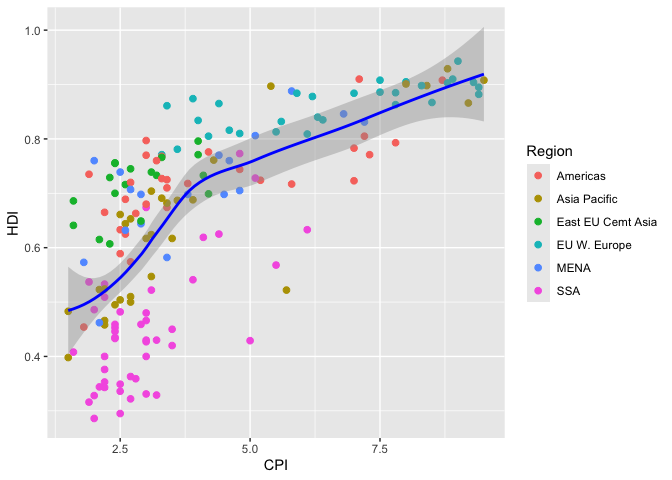
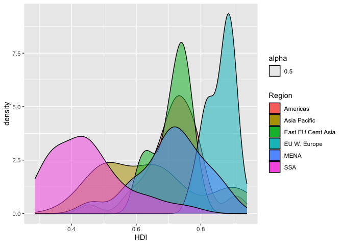
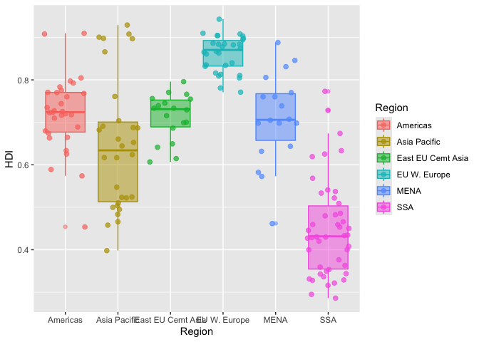

# assignment_4.qmd

Patrick Shea

# Assignment 4: Data Transformation

## **Instructions: Please read through this before you begin**

-   This assignment is due by **10pm on Thursday 09/25/2024**. Please
    upload it using your personal GitHub repository for this class.

-   You can start by making a copy of the Quarto template that you
    created as `assignment_1.qmd` and work from there (you wrote up most
    of the template text needed here in assignment 1; now you’ll be
    filling in the code chunks).

-   Please name your Quarto file `assignment_4.qmd` and select `gfm` as
    the output format.

-   For this assignment, please **reproduce this markdown file** using
    Quarto. This includes the following:

    -   **Reproduce this markdown template**, except for this list of
        instructions which you **don’t** have to include. Pay attention
        to all the formating in this file, including bullet points,
        bolded characters, inserted code chunks, headings, text colors,
        blank lines, etc.

    -   Write code to reproduce all the figures and tables shown. Have
        all your code embedded within the Quarto file, and show **BOTH
        your code and plots** in the rendered markdown file.

    -   When a verbal response is needed, answer by editing the part in
        the Quarto template where it says “Write your response here”.

    -   Use Quarto functionalities to **hide messages and warnings when
        needed**. (Suggestion: messages and warnings can often be
        informative and important, so please examine them carefully and
        only turn them off when you finish the exercise).

-   Note that Exercise 3 is **optional** (only Exercise 1 and 2 are
    required).

## Load packages

To start, load all the required packages with the following code.
Install them if they are not installed yet.

``` r
library(tidyverse)
library(knitr)
```

``` r
library(tidyverse)
```

```         
── Attaching core tidyverse packages ──────────────────────── tidyverse 2.0.0 ──
✔ dplyr     1.1.4     ✔ readr     2.1.5
✔ forcats   1.0.0     ✔ stringr   1.5.1
✔ ggplot2   3.5.2     ✔ tibble    3.3.0
✔ lubridate 1.9.4     ✔ tidyr     1.3.1
✔ purrr     1.1.0     
── Conflicts ────────────────────────────────────────── tidyverse_conflicts() ──
✖ dplyr::filter() masks stats::filter()
✖ dplyr::lag()    masks stats::lag()
ℹ Use the conflicted package (<http://conflicted.r-lib.org/>) to force all conflicts to become errors
```

``` r
library(knitr)
```

<br>

## Exercise 1. Corruption and human development

This exercise explores a dataset containing the human development index
(`HDI`) and corruption perception index (`CPI`) of 173 countries across
6 different regions around the world: Americas, Asia Pacific, Eastern
Europe and Central Asia (`East EU Cemt`), Western Europe
(`EU W. Europe`), Middle East and North Africa and Noth Africa (`MENA`),
and Sub-Saharan Africa (`SSA`). (Note: the larger `CPI` is, the less
corrupted the country is perceived to be.)

<br>

First, we load the data using the following code.

``` r
economist_data <- read_csv("https://raw.githubusercontent.com/nt246/NTRES-6100-data-science/master/datasets/EconomistData.csv")
```

<br>

``` r
economist_data <- read_csv("https://raw.githubusercontent.com/nt246/NTRES-6100-data-science/master/datasets/EconomistData.csv")
```

```         
New names:
Rows: 173 Columns: 6
── Column specification
──────────────────────────────────────────────────────── Delimiter: "," chr
(2): Country, Region dbl (4): ...1, HDI.Rank, HDI, CPI
ℹ Use `spec()` to retrieve the full column specification for this data. ℹ
Specify the column types or set `show_col_types = FALSE` to quiet this message.
• `` -> `...1`
```

#### 1.1 Show the first few rows of `economist_data`.

``` r
## Write your code here
economist_data
```

``` r
economist_data
```

```         
# A tibble: 173 × 6
    ...1 Country     HDI.Rank   HDI   CPI Region           
   <dbl> <chr>          <dbl> <dbl> <dbl> <chr>            
 1     1 Afghanistan      172 0.398   1.5 Asia Pacific     
 2     2 Albania           70 0.739   3.1 East EU Cemt Asia
 3     3 Algeria           96 0.698   2.9 MENA             
 4     4 Angola           148 0.486   2   SSA              
 5     5 Argentina         45 0.797   3   Americas         
 6     6 Armenia           86 0.716   2.6 East EU Cemt Asia
 7     7 Australia          2 0.929   8.8 Asia Pacific     
 8     8 Austria           19 0.885   7.8 EU W. Europe     
 9     9 Azerbaijan        91 0.7     2.4 East EU Cemt Asia
10    10 Bahamas           53 0.771   7.3 Americas         
# ℹ 163 more rows
```

#### 1.2 Expore the relationship between human development index (`HDI`) and corruption perception index (`CPI`) with a scatter plot as the following.

``` r
## Write your code here

economist_data |> ## same workflow as Thurs Class
  select(Country, HDI, CPI) |> ## selecting what I want to use 
  ggplot() + ## don't have to add ^^ or do it same way as base "r"
  geom_point(mapping = aes(x = HDI, y = CPI )) +
  labs(
    title = "Human Development Index vs Corruption Perception Index",
    x = "HDI",
    y = "CPI"
  ) + 
  theme_minimal() ## I like how it looks 
```

``` r
economist_data |> ## same workflow from Thurs Class
  select(Country, HDI, CPI) |> ## selecting what I want to use 
  ggplot() + ## don't have to add ^^ or do it same way as base "r"
  geom_point(mapping = aes(x = HDI, y = CPI )) +
  labs(
    title = "Human Development Index vs Corruption Perception Index",
    x = "HDI",
    y = "CPI"
  ) + 
  theme_minimal() ## I like how it looks 
```


#### 1.3 Make the color of all points in the previous plot red.

``` r
## 
  select(Country, HDI, CPI) |> ## selecting what I want to use 
  ggplot() + ## don't have to add ^^ or do it same way as base "r"
  geom_point(mapping = aes(x = HDI, y = CPI ), color = "red") +
  labs(
    title = "Human Development Index vs Corruption Perception Index",
    x = "HDI",
    y = "CPI"
  ) + 
  theme_minimal() ## I like how it looks 
```

``` r
economist_data |> ## same workflow from Thurs Class
  select(Country, HDI, CPI) |> ## selecting what I want to use 
  ggplot() + ## don't have to add ^^ or do it same way as base "r"
  geom_point(mapping = aes(x = HDI, y = CPI ), color = "red") +
  labs(
    title = "Human Development Index vs Corruption Perception Index",
    x = "HDI",
    y = "CPI"
  ) + 
  theme_minimal() ## I like how it looks 
```


#### 1.4 Color the points in the previous plot according to the `Region` variable, and set the size of points to 2.

``` r
## Write your code here
economist_data |> ## same workflow from Thurs Class
  select(Country, HDI, CPI, Region) |> ## selecting what I want to use 
  ggplot() + ## don't have to add ^^ or do it same way as base "r"
  geom_point(mapping = aes(x = HDI, y = CPI, color = Region), size = 2) + 
  labs(
    title = "Human Development Index vs Corruption Perception Index",
    x = "HDI",
    y = "CPI"
  ) + 
  theme_minimal() ## I like how it looks 
```

``` r
economist_data |> ## same workflow from Thurs Class
  select(Country, HDI, CPI, Region) |> ## selecting what I want to use 
  ggplot() + ## don't have to add ^^ or do it same way as base "r"
  geom_point(mapping = aes(x = HDI, y = CPI, color = Region), size = 2) + 
  labs(
    title = "Human Development Index vs Corruption Perception Index",
    x = "HDI",
    y = "CPI"
  ) + 
  theme_minimal() ## I like how it looks 
```


#### 1.5 Set the size of the points proportional to `HDI.Rank`

``` r
## Write your code here
economist_data |> ## same workflow from Thurs Class
  select(Country, HDI, CPI, Region, HDI.Rank) |> ## selecting what I want to use 
  ggplot() + ## don't have to add ^^ or do it same way as base "r"
  geom_point(mapping = aes(x = HDI, y = CPI, color = Region, size = HDI.Rank)) + ## need to keep track of ()
  labs(
    title = "Human Development Index vs Corruption Perception Index",
    x = "HDI",
    y = "CPI"
  ) + 
  theme_minimal() ## I like how it looks 
```

``` r
economist_data |> ## same workflow from Thurs Class
  select(Country, HDI, CPI, Region, HDI.Rank) |> ## selecting what I want to use 
  ggplot() + ## don't have to add ^^ or do it same way as base "r"
  geom_point(mapping = aes(x = HDI, y = CPI, color = Region, size = HDI.Rank)) + ## need to keep track of ()
  labs(
    title = "Human Development Index vs Corruption Perception Index",
    x = "HDI",
    y = "CPI"
  ) + 
  theme_minimal() ## I like how it looks 
```


<br>

#### 1.6 Fit a **smoothing line** to **all** the data points in the scatter plot from Exercise 1.4

``` r
## Write your code here
economist_data |> ## same workflow from Thurs Class
  select(Country, HDI, CPI, Region, HDI.Rank) |> ## selecting what I want to use 
  ggplot() + ## don't have to add ^^ or do it same way as base "r"
  geom_point(mapping = aes(x = HDI, y = CPI, color = Region, size = HDI.Rank)) + ## need to keep track of ()
  geom_smooth(mapping = aes(x = HDI, y = CPI), method = "lm", se = FALSE, color="black")+
  labs(
    title = "Human Development Index vs Corruption Perception Index",
    x = "HDI",
    y = "CPI"
  ) + 
  theme_minimal() ## I like how it looks 
```

``` r
economist_data |> ## same workflow from Thurs Class
  select(Country, HDI, CPI, Region, HDI.Rank) |> ## selecting what I want to use 
  ggplot() + ## don't have to add ^^ or do it same way as base "r"
  geom_point(mapping = aes(x = HDI, y = CPI, color = Region, size = HDI.Rank)) + ## need to keep track of ()
  geom_smooth(mapping = aes(x = HDI, y = CPI), method = "lm", se = FALSE, color="black")+
  labs(
    title = "Human Development Index vs Corruption Perception Index",
    x = "HDI",
    y = "CPI"
  ) + 
  theme_minimal() ## I like how it looks 
```

```         
`geom_smooth()` using formula = 'y ~ x'
```



#### 1.7 Fit a separate **straight line** for **each region** instead, and turn off the confidence interval.

``` r
economist_data |> ## same workflow from Thurs Class
  select(Country, HDI, CPI, Region, HDI.Rank) |> ## selecting what I want to use 
  ggplot() + ## don't have to add ^^ or do it same way as base "r"
  geom_point(mapping = aes(x = HDI, y = CPI, color = Region, size = HDI.Rank)) + ## need to keep track of ()
  geom_smooth(mapping = aes(x = HDI, y = CPI, color = Region), method = "lm", se = FALSE)+
  labs(
    title = "Human Development Index vs Corruption Perception Index",
    x = "HDI",
    y = "CPI"
  ) + 
  theme_minimal() ## I like how it looks 
```

``` r
economist_data |> ## same workflow from Thurs Class
  select(Country, HDI, CPI, Region, HDI.Rank) |> ## selecting what I want to use 
  ggplot() + ## don't have to add ^^ or do it same way as base "r"
  geom_point(mapping = aes(x = HDI, y = CPI, color = Region, size = HDI.Rank)) + ## need to keep track of ()
  geom_smooth(mapping = aes(x = HDI, y = CPI, color = Region), method = "lm", se = FALSE)+
  labs(
    title = "Human Development Index vs Corruption Perception Index",
    x = "HDI",
    y = "CPI"
  ) + 
  theme_minimal() ## I like how it looks 
```

```         
`geom_smooth()` using formula = 'y ~ x'
```


#### 1.8 Building on top of the previous plot, show each `Region` in a different facet.

``` r
## Write your code here
economist_data |> ## going to stop commenting
  select(Country, HDI, CPI, Region, HDI.Rank) |> 
  ggplot() + 
  geom_point(mapping = aes(x = HDI, y = CPI, color = Region, size = HDI.Rank)) + 
  geom_smooth(mapping = aes(x = HDI, y = CPI, color = Region), method = "lm", se = FALSE)+
  facet_wrap(~ Region) +
  labs(

    title = "Human Development Index vs Corruption Perception Index",
    x = "HDI",
    y = "CPI"
  ) + 
  theme_minimal() 
```

``` r
economist_data |> ## going to stop commenting
  select(Country, HDI, CPI, Region, HDI.Rank) |> 
  ggplot() + 
  geom_point(mapping = aes(x = HDI, y = CPI, color = Region, size = HDI.Rank)) + 
  geom_smooth(mapping = aes(x = HDI, y = CPI, color = Region), method = "lm", se = FALSE)+
  facet_wrap(~ Region) +
  labs(

    title = "Human Development Index vs Corruption Perception Index",
    x = "HDI",
    y = "CPI"
  ) + 
  theme_minimal() 
```

```         
`geom_smooth()` using formula = 'y ~ x'
```


#### 1.9 Show the distribution of `HDI` in each region using density plot. Set the transparency to 0.5

``` r
## Write your code here
?geom_density()
economist_data |> ## what i'm building off of 
  select(Country, HDI, Region,) |> 
  ggplot() + 
  geom_density(mapping = aes(x = HDI, fill = Region, alpha = 0.5 )) +
    labs(

    title = "Human Development Index vs Corruption Perception Index",
    x = "HDI",
    y = "Density"
  ) + 
  theme_minimal() 
```

``` r
economist_data |> ## what i'm building off of 
  select(Country, HDI, Region,) |> 
  ggplot() + 
  geom_density(mapping = aes(x = HDI, fill = Region, alpha = 0.5 )) +
    labs(

    title = "Human Development Index vs Corruption Perception Index",
    x = "HDI",
    y = "Density"
  ) + 
  theme_minimal() 
```



#### 1.10 Show the distribution of `HDI` in each region using histogram and facetting.

``` r
## Write your code here
```

``` r
economist_data |> 
  select(Country, HDI, Region) |> 
  ggplot() + 
  geom_histogram (mapping = aes(x = HDI)) +
  facet_wrap(~Region) + 
    labs(
    title = "Human Development Index vs Corruption Perception Index",
    x = "HDI",
    y = "Count"
  ) + 
  theme_minimal() 
```

```         
`stat_bin()` using `bins = 30`. Pick better value with `binwidth`.
```


<br>

#### 1.11 Show the distribution of `HDI` in each region using a box plot. Set the transparency of these boxes to 0.5 and do not show outlier points with the box plot. Instead, show all data points for each country in the same plot. (Hint: `geom_jitter()` or `position_jitter()` might be useful.)

``` r
## Write your code here
economist_data |> ## from Data Wrangling
  select(Country, HDI, Region) |> 
  ggplot() + 
  geom_boxplot(
    mapping = aes(x = Region, y = HDI), 
    alpha = 0.5, # turning transpercy to 0.5                     
  ) +
  geom_jitter(
    mapping = aes(x = Region, y = HDI),   
    alpha = 0.7,                          
    color = "black",                      
    size = 2
  ) +
  labs(
    title = "HDI by Region",
    x = "Region",
    y = "HDI"
  ) + 
  theme_minimal()
```

``` r
economist_data |> ## from Data Wrangling
  select(Country, HDI, Region) |> 
  ggplot() + 
  geom_boxplot(
    mapping = aes(x = Region, y = HDI), 
    alpha = 0.5, # turning transpercy to 0.5                     
  ) +
  geom_jitter(
    mapping = aes(x = Region, y = HDI),   
    alpha = 0.7,                          
    color = "black",                      
    size = 2
  ) +
  labs(
    title = "HDI by Region",
    x = "Region",
    y = "HDI"
  ) + 
  theme_minimal()
```



#### 1.12 Show the count of countries in each region using a bar plot.

``` r
## Write your code here
economist_data |> 
  select(Country, HDI, Region) |> 
  ggplot() + 
  geom_bar(mapping = aes( x = Region, fill = Region)) + 
             labs(
               title = "Count of Countries in Region",
               x = "Region",
               y = "Countries"
               ) + 
             theme_minimal()
```

``` r
economist_data |> 
  select(Country, HDI, Region) |> 
  ggplot() + 
  geom_bar(mapping = aes( x = Region, fill = Region)) + 
             labs(
               title = "Count of Countries in Region",
               x = "Region",
               y = "Countries"
               ) + 
             theme_minimal()
```


#### 1.13 You have now created a variety of different plots of the same dataset. Which of your plots do you think are the most informative? Describe briefly the major trends that you see in the data.

Answer: Even though it is a lot of information, I like the Human
Development Index vs Corruption Perception Index with dots proportional
to HDI rank because I think it helps us identify the distribution in a
helpful way.

Some trends: HDI is generally a higher value in what we would consider
“wealthy” or traditionally colonial countries. There is more variability
of HDI within regions than between regions.

## Exercise 2. Theophylline experiment

This exercise uses the `Theoph` data frame (comes with your R
installation), which has 132 rows and 5 columns of data from an
experiment on the pharmacokinetics of the anti-asthmatic drug
theophylline. Twelve subjects were given oral doses of theophylline then
serum concentrations were measured at 11 time points over the next 25
hours. You can learn more about this dataset by running `?Theoph`

Have a look at the data structure

``` r
## Write your code here
Theoph 
view(Theoph)
head(Theoph)
tail(Theoph)
```

``` r
Theoph
```

```         
Grouped Data: conc ~ Time | Subject
    Subject   Wt Dose  Time  conc
1         1 79.6 4.02  0.00  0.74
2         1 79.6 4.02  0.25  2.84
3         1 79.6 4.02  0.57  6.57
4         1 79.6 4.02  1.12 10.50
5         1 79.6 4.02  2.02  9.66
6         1 79.6 4.02  3.82  8.58
7         1 79.6 4.02  5.10  8.36
8         1 79.6 4.02  7.03  7.47
9         1 79.6 4.02  9.05  6.89
10        1 79.6 4.02 12.12  5.94
11        1 79.6 4.02 24.37  3.28
12        2 72.4 4.40  0.00  0.00
13        2 72.4 4.40  0.27  1.72
14        2 72.4 4.40  0.52  7.91
15        2 72.4 4.40  1.00  8.31
16        2 72.4 4.40  1.92  8.33
17        2 72.4 4.40  3.50  6.85
18        2 72.4 4.40  5.02  6.08
19        2 72.4 4.40  7.03  5.40
20        2 72.4 4.40  9.00  4.55
21        2 72.4 4.40 12.00  3.01
22        2 72.4 4.40 24.30  0.90
23        3 70.5 4.53  0.00  0.00
24        3 70.5 4.53  0.27  4.40
25        3 70.5 4.53  0.58  6.90
26        3 70.5 4.53  1.02  8.20
27        3 70.5 4.53  2.02  7.80
28        3 70.5 4.53  3.62  7.50
29        3 70.5 4.53  5.08  6.20
30        3 70.5 4.53  7.07  5.30
31        3 70.5 4.53  9.00  4.90
32        3 70.5 4.53 12.15  3.70
33        3 70.5 4.53 24.17  1.05
34        4 72.7 4.40  0.00  0.00
35        4 72.7 4.40  0.35  1.89
36        4 72.7 4.40  0.60  4.60
37        4 72.7 4.40  1.07  8.60
38        4 72.7 4.40  2.13  8.38
39        4 72.7 4.40  3.50  7.54
40        4 72.7 4.40  5.02  6.88
41        4 72.7 4.40  7.02  5.78
42        4 72.7 4.40  9.02  5.33
43        4 72.7 4.40 11.98  4.19
44        4 72.7 4.40 24.65  1.15
45        5 54.6 5.86  0.00  0.00
46        5 54.6 5.86  0.30  2.02
47        5 54.6 5.86  0.52  5.63
48        5 54.6 5.86  1.00 11.40
49        5 54.6 5.86  2.02  9.33
50        5 54.6 5.86  3.50  8.74
51        5 54.6 5.86  5.02  7.56
52        5 54.6 5.86  7.02  7.09
53        5 54.6 5.86  9.10  5.90
54        5 54.6 5.86 12.00  4.37
55        5 54.6 5.86 24.35  1.57
56        6 80.0 4.00  0.00  0.00
57        6 80.0 4.00  0.27  1.29
58        6 80.0 4.00  0.58  3.08
59        6 80.0 4.00  1.15  6.44
60        6 80.0 4.00  2.03  6.32
61        6 80.0 4.00  3.57  5.53
62        6 80.0 4.00  5.00  4.94
63        6 80.0 4.00  7.00  4.02
64        6 80.0 4.00  9.22  3.46
65        6 80.0 4.00 12.10  2.78
66        6 80.0 4.00 23.85  0.92
67        7 64.6 4.95  0.00  0.15
68        7 64.6 4.95  0.25  0.85
69        7 64.6 4.95  0.50  2.35
70        7 64.6 4.95  1.02  5.02
71        7 64.6 4.95  2.02  6.58
72        7 64.6 4.95  3.48  7.09
73        7 64.6 4.95  5.00  6.66
74        7 64.6 4.95  6.98  5.25
75        7 64.6 4.95  9.00  4.39
76        7 64.6 4.95 12.05  3.53
77        7 64.6 4.95 24.22  1.15
78        8 70.5 4.53  0.00  0.00
79        8 70.5 4.53  0.25  3.05
80        8 70.5 4.53  0.52  3.05
81        8 70.5 4.53  0.98  7.31
82        8 70.5 4.53  2.02  7.56
83        8 70.5 4.53  3.53  6.59
84        8 70.5 4.53  5.05  5.88
85        8 70.5 4.53  7.15  4.73
86        8 70.5 4.53  9.07  4.57
87        8 70.5 4.53 12.10  3.00
88        8 70.5 4.53 24.12  1.25
89        9 86.4 3.10  0.00  0.00
90        9 86.4 3.10  0.30  7.37
91        9 86.4 3.10  0.63  9.03
92        9 86.4 3.10  1.05  7.14
93        9 86.4 3.10  2.02  6.33
94        9 86.4 3.10  3.53  5.66
95        9 86.4 3.10  5.02  5.67
96        9 86.4 3.10  7.17  4.24
97        9 86.4 3.10  8.80  4.11
98        9 86.4 3.10 11.60  3.16
99        9 86.4 3.10 24.43  1.12
100      10 58.2 5.50  0.00  0.24
101      10 58.2 5.50  0.37  2.89
102      10 58.2 5.50  0.77  5.22
103      10 58.2 5.50  1.02  6.41
104      10 58.2 5.50  2.05  7.83
105      10 58.2 5.50  3.55 10.21
106      10 58.2 5.50  5.05  9.18
107      10 58.2 5.50  7.08  8.02
108      10 58.2 5.50  9.38  7.14
109      10 58.2 5.50 12.10  5.68
110      10 58.2 5.50 23.70  2.42
111      11 65.0 4.92  0.00  0.00
112      11 65.0 4.92  0.25  4.86
113      11 65.0 4.92  0.50  7.24
114      11 65.0 4.92  0.98  8.00
115      11 65.0 4.92  1.98  6.81
116      11 65.0 4.92  3.60  5.87
117      11 65.0 4.92  5.02  5.22
118      11 65.0 4.92  7.03  4.45
119      11 65.0 4.92  9.03  3.62
120      11 65.0 4.92 12.12  2.69
121      11 65.0 4.92 24.08  0.86
122      12 60.5 5.30  0.00  0.00
123      12 60.5 5.30  0.25  1.25
124      12 60.5 5.30  0.50  3.96
125      12 60.5 5.30  1.00  7.82
126      12 60.5 5.30  2.00  9.72
127      12 60.5 5.30  3.52  9.75
128      12 60.5 5.30  5.07  8.57
129      12 60.5 5.30  7.07  6.59
130      12 60.5 5.30  9.03  6.11
131      12 60.5 5.30 12.05  4.57
132      12 60.5 5.30 24.15  1.17
```

``` r
view(Theoph)
head(Theoph)
```

```         
Grouped Data: conc ~ Time | Subject
  Subject   Wt Dose Time  conc
1       1 79.6 4.02 0.00  0.74
2       1 79.6 4.02 0.25  2.84
3       1 79.6 4.02 0.57  6.57
4       1 79.6 4.02 1.12 10.50
5       1 79.6 4.02 2.02  9.66
6       1 79.6 4.02 3.82  8.58
```

``` r
tail(Theoph)
```

```         
Grouped Data: conc ~ Time | Subject
    Subject   Wt Dose  Time conc
127      12 60.5  5.3  3.52 9.75
128      12 60.5  5.3  5.07 8.57
129      12 60.5  5.3  7.07 6.59
130      12 60.5  5.3  9.03 6.11
131      12 60.5  5.3 12.05 4.57
132      12 60.5  5.3 24.15 1.17
```

``` r
kable(Theoph)
```

| Subject |   Wt | Dose |  Time |  conc |
|:--------|-----:|-----:|------:|------:|
| 1       | 79.6 | 4.02 |  0.00 |  0.74 |
| 1       | 79.6 | 4.02 |  0.25 |  2.84 |
| 1       | 79.6 | 4.02 |  0.57 |  6.57 |
| 1       | 79.6 | 4.02 |  1.12 | 10.50 |
| 1       | 79.6 | 4.02 |  2.02 |  9.66 |
| 1       | 79.6 | 4.02 |  3.82 |  8.58 |
| 1       | 79.6 | 4.02 |  5.10 |  8.36 |
| 1       | 79.6 | 4.02 |  7.03 |  7.47 |
| 1       | 79.6 | 4.02 |  9.05 |  6.89 |
| 1       | 79.6 | 4.02 | 12.12 |  5.94 |
| 1       | 79.6 | 4.02 | 24.37 |  3.28 |
| 2       | 72.4 | 4.40 |  0.00 |  0.00 |
| 2       | 72.4 | 4.40 |  0.27 |  1.72 |
| 2       | 72.4 | 4.40 |  0.52 |  7.91 |
| 2       | 72.4 | 4.40 |  1.00 |  8.31 |
| 2       | 72.4 | 4.40 |  1.92 |  8.33 |
| 2       | 72.4 | 4.40 |  3.50 |  6.85 |
| 2       | 72.4 | 4.40 |  5.02 |  6.08 |
| 2       | 72.4 | 4.40 |  7.03 |  5.40 |
| 2       | 72.4 | 4.40 |  9.00 |  4.55 |
| 2       | 72.4 | 4.40 | 12.00 |  3.01 |
| 2       | 72.4 | 4.40 | 24.30 |  0.90 |
| 3       | 70.5 | 4.53 |  0.00 |  0.00 |
| 3       | 70.5 | 4.53 |  0.27 |  4.40 |
| 3       | 70.5 | 4.53 |  0.58 |  6.90 |
| 3       | 70.5 | 4.53 |  1.02 |  8.20 |
| 3       | 70.5 | 4.53 |  2.02 |  7.80 |
| 3       | 70.5 | 4.53 |  3.62 |  7.50 |
| 3       | 70.5 | 4.53 |  5.08 |  6.20 |
| 3       | 70.5 | 4.53 |  7.07 |  5.30 |
| 3       | 70.5 | 4.53 |  9.00 |  4.90 |
| 3       | 70.5 | 4.53 | 12.15 |  3.70 |
| 3       | 70.5 | 4.53 | 24.17 |  1.05 |
| 4       | 72.7 | 4.40 |  0.00 |  0.00 |
| 4       | 72.7 | 4.40 |  0.35 |  1.89 |
| 4       | 72.7 | 4.40 |  0.60 |  4.60 |
| 4       | 72.7 | 4.40 |  1.07 |  8.60 |
| 4       | 72.7 | 4.40 |  2.13 |  8.38 |
| 4       | 72.7 | 4.40 |  3.50 |  7.54 |
| 4       | 72.7 | 4.40 |  5.02 |  6.88 |
| 4       | 72.7 | 4.40 |  7.02 |  5.78 |
| 4       | 72.7 | 4.40 |  9.02 |  5.33 |
| 4       | 72.7 | 4.40 | 11.98 |  4.19 |
| 4       | 72.7 | 4.40 | 24.65 |  1.15 |
| 5       | 54.6 | 5.86 |  0.00 |  0.00 |
| 5       | 54.6 | 5.86 |  0.30 |  2.02 |
| 5       | 54.6 | 5.86 |  0.52 |  5.63 |
| 5       | 54.6 | 5.86 |  1.00 | 11.40 |
| 5       | 54.6 | 5.86 |  2.02 |  9.33 |
| 5       | 54.6 | 5.86 |  3.50 |  8.74 |
| 5       | 54.6 | 5.86 |  5.02 |  7.56 |
| 5       | 54.6 | 5.86 |  7.02 |  7.09 |
| 5       | 54.6 | 5.86 |  9.10 |  5.90 |
| 5       | 54.6 | 5.86 | 12.00 |  4.37 |
| 5       | 54.6 | 5.86 | 24.35 |  1.57 |
| 6       | 80.0 | 4.00 |  0.00 |  0.00 |
| 6       | 80.0 | 4.00 |  0.27 |  1.29 |
| 6       | 80.0 | 4.00 |  0.58 |  3.08 |
| 6       | 80.0 | 4.00 |  1.15 |  6.44 |
| 6       | 80.0 | 4.00 |  2.03 |  6.32 |
| 6       | 80.0 | 4.00 |  3.57 |  5.53 |
| 6       | 80.0 | 4.00 |  5.00 |  4.94 |
| 6       | 80.0 | 4.00 |  7.00 |  4.02 |
| 6       | 80.0 | 4.00 |  9.22 |  3.46 |
| 6       | 80.0 | 4.00 | 12.10 |  2.78 |
| 6       | 80.0 | 4.00 | 23.85 |  0.92 |
| 7       | 64.6 | 4.95 |  0.00 |  0.15 |
| 7       | 64.6 | 4.95 |  0.25 |  0.85 |
| 7       | 64.6 | 4.95 |  0.50 |  2.35 |
| 7       | 64.6 | 4.95 |  1.02 |  5.02 |
| 7       | 64.6 | 4.95 |  2.02 |  6.58 |
| 7       | 64.6 | 4.95 |  3.48 |  7.09 |
| 7       | 64.6 | 4.95 |  5.00 |  6.66 |
| 7       | 64.6 | 4.95 |  6.98 |  5.25 |
| 7       | 64.6 | 4.95 |  9.00 |  4.39 |
| 7       | 64.6 | 4.95 | 12.05 |  3.53 |
| 7       | 64.6 | 4.95 | 24.22 |  1.15 |
| 8       | 70.5 | 4.53 |  0.00 |  0.00 |
| 8       | 70.5 | 4.53 |  0.25 |  3.05 |
| 8       | 70.5 | 4.53 |  0.52 |  3.05 |
| 8       | 70.5 | 4.53 |  0.98 |  7.31 |
| 8       | 70.5 | 4.53 |  2.02 |  7.56 |
| 8       | 70.5 | 4.53 |  3.53 |  6.59 |
| 8       | 70.5 | 4.53 |  5.05 |  5.88 |
| 8       | 70.5 | 4.53 |  7.15 |  4.73 |
| 8       | 70.5 | 4.53 |  9.07 |  4.57 |
| 8       | 70.5 | 4.53 | 12.10 |  3.00 |
| 8       | 70.5 | 4.53 | 24.12 |  1.25 |
| 9       | 86.4 | 3.10 |  0.00 |  0.00 |
| 9       | 86.4 | 3.10 |  0.30 |  7.37 |
| 9       | 86.4 | 3.10 |  0.63 |  9.03 |
| 9       | 86.4 | 3.10 |  1.05 |  7.14 |
| 9       | 86.4 | 3.10 |  2.02 |  6.33 |
| 9       | 86.4 | 3.10 |  3.53 |  5.66 |
| 9       | 86.4 | 3.10 |  5.02 |  5.67 |
| 9       | 86.4 | 3.10 |  7.17 |  4.24 |
| 9       | 86.4 | 3.10 |  8.80 |  4.11 |
| 9       | 86.4 | 3.10 | 11.60 |  3.16 |
| 9       | 86.4 | 3.10 | 24.43 |  1.12 |
| 10      | 58.2 | 5.50 |  0.00 |  0.24 |
| 10      | 58.2 | 5.50 |  0.37 |  2.89 |
| 10      | 58.2 | 5.50 |  0.77 |  5.22 |
| 10      | 58.2 | 5.50 |  1.02 |  6.41 |
| 10      | 58.2 | 5.50 |  2.05 |  7.83 |
| 10      | 58.2 | 5.50 |  3.55 | 10.21 |
| 10      | 58.2 | 5.50 |  5.05 |  9.18 |
| 10      | 58.2 | 5.50 |  7.08 |  8.02 |
| 10      | 58.2 | 5.50 |  9.38 |  7.14 |
| 10      | 58.2 | 5.50 | 12.10 |  5.68 |
| 10      | 58.2 | 5.50 | 23.70 |  2.42 |
| 11      | 65.0 | 4.92 |  0.00 |  0.00 |
| 11      | 65.0 | 4.92 |  0.25 |  4.86 |
| 11      | 65.0 | 4.92 |  0.50 |  7.24 |
| 11      | 65.0 | 4.92 |  0.98 |  8.00 |
| 11      | 65.0 | 4.92 |  1.98 |  6.81 |
| 11      | 65.0 | 4.92 |  3.60 |  5.87 |
| 11      | 65.0 | 4.92 |  5.02 |  5.22 |
| 11      | 65.0 | 4.92 |  7.03 |  4.45 |
| 11      | 65.0 | 4.92 |  9.03 |  3.62 |
| 11      | 65.0 | 4.92 | 12.12 |  2.69 |
| 11      | 65.0 | 4.92 | 24.08 |  0.86 |
| 12      | 60.5 | 5.30 |  0.00 |  0.00 |
| 12      | 60.5 | 5.30 |  0.25 |  1.25 |
| 12      | 60.5 | 5.30 |  0.50 |  3.96 |
| 12      | 60.5 | 5.30 |  1.00 |  7.82 |
| 12      | 60.5 | 5.30 |  2.00 |  9.72 |
| 12      | 60.5 | 5.30 |  3.52 |  9.75 |
| 12      | 60.5 | 5.30 |  5.07 |  8.57 |
| 12      | 60.5 | 5.30 |  7.07 |  6.59 |
| 12      | 60.5 | 5.30 |  9.03 |  6.11 |
| 12      | 60.5 | 5.30 | 12.05 |  4.57 |
| 12      | 60.5 | 5.30 | 24.15 |  1.17 |

For the following exercise, **transform the data as instructed**. Try to
use `tidyverse` functions even if you are more comfortable with base-R
solutions. Show the **first 6 lines** of the transformed data in a table
through RMarkdown **using the kable() function**, as shown above.

#### 2.1 Select columns that contain a lower case “t” in the `Theoph` dataset. Do not manually list all the columns to include.

``` r
## Write your code here
Theoph |> 
  select(contains("t"))
```

``` r
Theoph |> 
  select(contains("t"))
```

```         
    Subject   Wt  Time
1         1 79.6  0.00
2         1 79.6  0.25
3         1 79.6  0.57
4         1 79.6  1.12
5         1 79.6  2.02
6         1 79.6  3.82
7         1 79.6  5.10
8         1 79.6  7.03
9         1 79.6  9.05
10        1 79.6 12.12
11        1 79.6 24.37
12        2 72.4  0.00
13        2 72.4  0.27
14        2 72.4  0.52
15        2 72.4  1.00
16        2 72.4  1.92
17        2 72.4  3.50
18        2 72.4  5.02
19        2 72.4  7.03
20        2 72.4  9.00
21        2 72.4 12.00
22        2 72.4 24.30
23        3 70.5  0.00
24        3 70.5  0.27
25        3 70.5  0.58
26        3 70.5  1.02
27        3 70.5  2.02
28        3 70.5  3.62
29        3 70.5  5.08
30        3 70.5  7.07
31        3 70.5  9.00
32        3 70.5 12.15
33        3 70.5 24.17
34        4 72.7  0.00
35        4 72.7  0.35
36        4 72.7  0.60
37        4 72.7  1.07
38        4 72.7  2.13
39        4 72.7  3.50
40        4 72.7  5.02
41        4 72.7  7.02
42        4 72.7  9.02
43        4 72.7 11.98
44        4 72.7 24.65
45        5 54.6  0.00
46        5 54.6  0.30
47        5 54.6  0.52
48        5 54.6  1.00
49        5 54.6  2.02
50        5 54.6  3.50
51        5 54.6  5.02
52        5 54.6  7.02
53        5 54.6  9.10
54        5 54.6 12.00
55        5 54.6 24.35
56        6 80.0  0.00
57        6 80.0  0.27
58        6 80.0  0.58
59        6 80.0  1.15
60        6 80.0  2.03
61        6 80.0  3.57
62        6 80.0  5.00
63        6 80.0  7.00
64        6 80.0  9.22
65        6 80.0 12.10
66        6 80.0 23.85
67        7 64.6  0.00
68        7 64.6  0.25
69        7 64.6  0.50
70        7 64.6  1.02
71        7 64.6  2.02
72        7 64.6  3.48
73        7 64.6  5.00
74        7 64.6  6.98
75        7 64.6  9.00
76        7 64.6 12.05
77        7 64.6 24.22
78        8 70.5  0.00
79        8 70.5  0.25
80        8 70.5  0.52
81        8 70.5  0.98
82        8 70.5  2.02
83        8 70.5  3.53
84        8 70.5  5.05
85        8 70.5  7.15
86        8 70.5  9.07
87        8 70.5 12.10
88        8 70.5 24.12
89        9 86.4  0.00
90        9 86.4  0.30
91        9 86.4  0.63
92        9 86.4  1.05
93        9 86.4  2.02
94        9 86.4  3.53
95        9 86.4  5.02
96        9 86.4  7.17
97        9 86.4  8.80
98        9 86.4 11.60
99        9 86.4 24.43
100      10 58.2  0.00
101      10 58.2  0.37
102      10 58.2  0.77
103      10 58.2  1.02
104      10 58.2  2.05
105      10 58.2  3.55
106      10 58.2  5.05
107      10 58.2  7.08
108      10 58.2  9.38
109      10 58.2 12.10
110      10 58.2 23.70
111      11 65.0  0.00
112      11 65.0  0.25
113      11 65.0  0.50
114      11 65.0  0.98
115      11 65.0  1.98
116      11 65.0  3.60
117      11 65.0  5.02
118      11 65.0  7.03
119      11 65.0  9.03
120      11 65.0 12.12
121      11 65.0 24.08
122      12 60.5  0.00
123      12 60.5  0.25
124      12 60.5  0.50
125      12 60.5  1.00
126      12 60.5  2.00
127      12 60.5  3.52
128      12 60.5  5.07
129      12 60.5  7.07
130      12 60.5  9.03
131      12 60.5 12.05
132      12 60.5 24.15
```

#### 2.2 Rename the `Wt` column to `Weight` and `conc` column to `Concentration` in the `Theoph` dataset.

``` r
## Write your code here
```

``` r
Theoph |> 
    Weight = Wt,
    Concentration = conc ## "good habits" by having one idea per line of code  
  )
```

```         
Grouped Data: conc ~ Time | Subject
    Subject Weight Dose  Time Concentration
1         1   79.6 4.02  0.00          0.74
2         1   79.6 4.02  0.25          2.84
3         1   79.6 4.02  0.57          6.57
4         1   79.6 4.02  1.12         10.50
5         1   79.6 4.02  2.02          9.66
6         1   79.6 4.02  3.82          8.58
7         1   79.6 4.02  5.10          8.36
8         1   79.6 4.02  7.03          7.47
9         1   79.6 4.02  9.05          6.89
10        1   79.6 4.02 12.12          5.94
11        1   79.6 4.02 24.37          3.28
12        2   72.4 4.40  0.00          0.00
13        2   72.4 4.40  0.27          1.72
14        2   72.4 4.40  0.52          7.91
15        2   72.4 4.40  1.00          8.31
16        2   72.4 4.40  1.92          8.33
17        2   72.4 4.40  3.50          6.85
18        2   72.4 4.40  5.02          6.08
19        2   72.4 4.40  7.03          5.40
20        2   72.4 4.40  9.00          4.55
21        2   72.4 4.40 12.00          3.01
22        2   72.4 4.40 24.30          0.90
23        3   70.5 4.53  0.00          0.00
24        3   70.5 4.53  0.27          4.40
25        3   70.5 4.53  0.58          6.90
26        3   70.5 4.53  1.02          8.20
27        3   70.5 4.53  2.02          7.80
28        3   70.5 4.53  3.62          7.50
29        3   70.5 4.53  5.08          6.20
30        3   70.5 4.53  7.07          5.30
31        3   70.5 4.53  9.00          4.90
32        3   70.5 4.53 12.15          3.70
33        3   70.5 4.53 24.17          1.05
34        4   72.7 4.40  0.00          0.00
35        4   72.7 4.40  0.35          1.89
36        4   72.7 4.40  0.60          4.60
37        4   72.7 4.40  1.07          8.60
38        4   72.7 4.40  2.13          8.38
39        4   72.7 4.40  3.50          7.54
40        4   72.7 4.40  5.02          6.88
41        4   72.7 4.40  7.02          5.78
42        4   72.7 4.40  9.02          5.33
43        4   72.7 4.40 11.98          4.19
44        4   72.7 4.40 24.65          1.15
45        5   54.6 5.86  0.00          0.00
46        5   54.6 5.86  0.30          2.02
47        5   54.6 5.86  0.52          5.63
48        5   54.6 5.86  1.00         11.40
49        5   54.6 5.86  2.02          9.33
50        5   54.6 5.86  3.50          8.74
51        5   54.6 5.86  5.02          7.56
52        5   54.6 5.86  7.02          7.09
53        5   54.6 5.86  9.10          5.90
54        5   54.6 5.86 12.00          4.37
55        5   54.6 5.86 24.35          1.57
56        6   80.0 4.00  0.00          0.00
57        6   80.0 4.00  0.27          1.29
58        6   80.0 4.00  0.58          3.08
59        6   80.0 4.00  1.15          6.44
60        6   80.0 4.00  2.03          6.32
61        6   80.0 4.00  3.57          5.53
62        6   80.0 4.00  5.00          4.94
63        6   80.0 4.00  7.00          4.02
64        6   80.0 4.00  9.22          3.46
65        6   80.0 4.00 12.10          2.78
66        6   80.0 4.00 23.85          0.92
67        7   64.6 4.95  0.00          0.15
68        7   64.6 4.95  0.25          0.85
69        7   64.6 4.95  0.50          2.35
70        7   64.6 4.95  1.02          5.02
71        7   64.6 4.95  2.02          6.58
72        7   64.6 4.95  3.48          7.09
73        7   64.6 4.95  5.00          6.66
74        7   64.6 4.95  6.98          5.25
75        7   64.6 4.95  9.00          4.39
76        7   64.6 4.95 12.05          3.53
77        7   64.6 4.95 24.22          1.15
78        8   70.5 4.53  0.00          0.00
79        8   70.5 4.53  0.25          3.05
80        8   70.5 4.53  0.52          3.05
81        8   70.5 4.53  0.98          7.31
82        8   70.5 4.53  2.02          7.56
83        8   70.5 4.53  3.53          6.59
84        8   70.5 4.53  5.05          5.88
85        8   70.5 4.53  7.15          4.73
86        8   70.5 4.53  9.07          4.57
87        8   70.5 4.53 12.10          3.00
88        8   70.5 4.53 24.12          1.25
89        9   86.4 3.10  0.00          0.00
90        9   86.4 3.10  0.30          7.37
91        9   86.4 3.10  0.63          9.03
92        9   86.4 3.10  1.05          7.14
93        9   86.4 3.10  2.02          6.33
94        9   86.4 3.10  3.53          5.66
95        9   86.4 3.10  5.02          5.67
96        9   86.4 3.10  7.17          4.24
97        9   86.4 3.10  8.80          4.11
98        9   86.4 3.10 11.60          3.16
99        9   86.4 3.10 24.43          1.12
100      10   58.2 5.50  0.00          0.24
101      10   58.2 5.50  0.37          2.89
102      10   58.2 5.50  0.77          5.22
103      10   58.2 5.50  1.02          6.41
104      10   58.2 5.50  2.05          7.83
105      10   58.2 5.50  3.55         10.21
106      10   58.2 5.50  5.05          9.18
107      10   58.2 5.50  7.08          8.02
108      10   58.2 5.50  9.38          7.14
109      10   58.2 5.50 12.10          5.68
110      10   58.2 5.50 23.70          2.42
111      11   65.0 4.92  0.00          0.00
112      11   65.0 4.92  0.25          4.86
113      11   65.0 4.92  0.50          7.24
114      11   65.0 4.92  0.98          8.00
115      11   65.0 4.92  1.98          6.81
116      11   65.0 4.92  3.60          5.87
117      11   65.0 4.92  5.02          5.22
118      11   65.0 4.92  7.03          4.45
119      11   65.0 4.92  9.03          3.62
120      11   65.0 4.92 12.12          2.69
121      11   65.0 4.92 24.08          0.86
122      12   60.5 5.30  0.00          0.00
123      12   60.5 5.30  0.25          1.25
124      12   60.5 5.30  0.50          3.96
125      12   60.5 5.30  1.00          7.82
126      12   60.5 5.30  2.00          9.72
127      12   60.5 5.30  3.52          9.75
128      12   60.5 5.30  5.07          8.57
129      12   60.5 5.30  7.07          6.59
130      12   60.5 5.30  9.03          6.11
131      12   60.5 5.30 12.05          4.57
132      12   60.5 5.30 24.15          1.17
```

#### 2.3 Extract the `Dose` greater than 4.5 and `Time` greater than the mean `Time`.

``` r
## Write your code here
```

``` r
Theoph |> 
  filter(Dose > 4.5, Time> mean(Time)) ## searching ?filter gave the idea for the code 
```

```         
Grouped Data: conc ~ Time | Subject
   Subject   Wt Dose  Time conc
1        3 70.5 4.53  7.07 5.30
2        3 70.5 4.53  9.00 4.90
3        3 70.5 4.53 12.15 3.70
4        3 70.5 4.53 24.17 1.05
5        5 54.6 5.86  7.02 7.09
6        5 54.6 5.86  9.10 5.90
7        5 54.6 5.86 12.00 4.37
8        5 54.6 5.86 24.35 1.57
9        7 64.6 4.95  6.98 5.25
10       7 64.6 4.95  9.00 4.39
11       7 64.6 4.95 12.05 3.53
12       7 64.6 4.95 24.22 1.15
13       8 70.5 4.53  7.15 4.73
14       8 70.5 4.53  9.07 4.57
15       8 70.5 4.53 12.10 3.00
16       8 70.5 4.53 24.12 1.25
17      10 58.2 5.50  7.08 8.02
18      10 58.2 5.50  9.38 7.14
19      10 58.2 5.50 12.10 5.68
20      10 58.2 5.50 23.70 2.42
21      11 65.0 4.92  7.03 4.45
22      11 65.0 4.92  9.03 3.62
23      11 65.0 4.92 12.12 2.69
24      11 65.0 4.92 24.08 0.86
25      12 60.5 5.30  7.07 6.59
26      12 60.5 5.30  9.03 6.11
27      12 60.5 5.30 12.05 4.57
28      12 60.5 5.30 24.15 1.17
```

#### 2.4 Sort the `Theoph` dataset by `Wt` from smallest to largest and secondarily by Time from largest to smallest.

``` r
## Write your code here
Theoph |> 
  arrange(Wt, desc(Time))
```

``` r
Theoph |> 
  arrange(Wt, desc(Time))
```

```         
Grouped Data: conc ~ Time | Subject
    Subject   Wt Dose  Time  conc
1         5 54.6 5.86 24.35  1.57
2         5 54.6 5.86 12.00  4.37
3         5 54.6 5.86  9.10  5.90
4         5 54.6 5.86  7.02  7.09
5         5 54.6 5.86  5.02  7.56
6         5 54.6 5.86  3.50  8.74
7         5 54.6 5.86  2.02  9.33
8         5 54.6 5.86  1.00 11.40
9         5 54.6 5.86  0.52  5.63
10        5 54.6 5.86  0.30  2.02
11        5 54.6 5.86  0.00  0.00
12       10 58.2 5.50 23.70  2.42
13       10 58.2 5.50 12.10  5.68
14       10 58.2 5.50  9.38  7.14
15       10 58.2 5.50  7.08  8.02
16       10 58.2 5.50  5.05  9.18
17       10 58.2 5.50  3.55 10.21
18       10 58.2 5.50  2.05  7.83
19       10 58.2 5.50  1.02  6.41
20       10 58.2 5.50  0.77  5.22
21       10 58.2 5.50  0.37  2.89
22       10 58.2 5.50  0.00  0.24
23       12 60.5 5.30 24.15  1.17
24       12 60.5 5.30 12.05  4.57
25       12 60.5 5.30  9.03  6.11
26       12 60.5 5.30  7.07  6.59
27       12 60.5 5.30  5.07  8.57
28       12 60.5 5.30  3.52  9.75
29       12 60.5 5.30  2.00  9.72
30       12 60.5 5.30  1.00  7.82
31       12 60.5 5.30  0.50  3.96
32       12 60.5 5.30  0.25  1.25
33       12 60.5 5.30  0.00  0.00
34        7 64.6 4.95 24.22  1.15
35        7 64.6 4.95 12.05  3.53
36        7 64.6 4.95  9.00  4.39
37        7 64.6 4.95  6.98  5.25
38        7 64.6 4.95  5.00  6.66
39        7 64.6 4.95  3.48  7.09
40        7 64.6 4.95  2.02  6.58
41        7 64.6 4.95  1.02  5.02
42        7 64.6 4.95  0.50  2.35
43        7 64.6 4.95  0.25  0.85
44        7 64.6 4.95  0.00  0.15
45       11 65.0 4.92 24.08  0.86
46       11 65.0 4.92 12.12  2.69
47       11 65.0 4.92  9.03  3.62
48       11 65.0 4.92  7.03  4.45
49       11 65.0 4.92  5.02  5.22
50       11 65.0 4.92  3.60  5.87
51       11 65.0 4.92  1.98  6.81
52       11 65.0 4.92  0.98  8.00
53       11 65.0 4.92  0.50  7.24
54       11 65.0 4.92  0.25  4.86
55       11 65.0 4.92  0.00  0.00
56        3 70.5 4.53 24.17  1.05
57        8 70.5 4.53 24.12  1.25
58        3 70.5 4.53 12.15  3.70
59        8 70.5 4.53 12.10  3.00
60        8 70.5 4.53  9.07  4.57
61        3 70.5 4.53  9.00  4.90
62        8 70.5 4.53  7.15  4.73
63        3 70.5 4.53  7.07  5.30
64        3 70.5 4.53  5.08  6.20
65        8 70.5 4.53  5.05  5.88
66        3 70.5 4.53  3.62  7.50
67        8 70.5 4.53  3.53  6.59
68        3 70.5 4.53  2.02  7.80
69        8 70.5 4.53  2.02  7.56
70        3 70.5 4.53  1.02  8.20
71        8 70.5 4.53  0.98  7.31
72        3 70.5 4.53  0.58  6.90
73        8 70.5 4.53  0.52  3.05
74        3 70.5 4.53  0.27  4.40
75        8 70.5 4.53  0.25  3.05
76        3 70.5 4.53  0.00  0.00
77        8 70.5 4.53  0.00  0.00
78        2 72.4 4.40 24.30  0.90
79        2 72.4 4.40 12.00  3.01
80        2 72.4 4.40  9.00  4.55
81        2 72.4 4.40  7.03  5.40
82        2 72.4 4.40  5.02  6.08
83        2 72.4 4.40  3.50  6.85
84        2 72.4 4.40  1.92  8.33
85        2 72.4 4.40  1.00  8.31
86        2 72.4 4.40  0.52  7.91
87        2 72.4 4.40  0.27  1.72
88        2 72.4 4.40  0.00  0.00
89        4 72.7 4.40 24.65  1.15
90        4 72.7 4.40 11.98  4.19
91        4 72.7 4.40  9.02  5.33
92        4 72.7 4.40  7.02  5.78
93        4 72.7 4.40  5.02  6.88
94        4 72.7 4.40  3.50  7.54
95        4 72.7 4.40  2.13  8.38
96        4 72.7 4.40  1.07  8.60
97        4 72.7 4.40  0.60  4.60
98        4 72.7 4.40  0.35  1.89
99        4 72.7 4.40  0.00  0.00
100       1 79.6 4.02 24.37  3.28
101       1 79.6 4.02 12.12  5.94
102       1 79.6 4.02  9.05  6.89
103       1 79.6 4.02  7.03  7.47
104       1 79.6 4.02  5.10  8.36
105       1 79.6 4.02  3.82  8.58
106       1 79.6 4.02  2.02  9.66
107       1 79.6 4.02  1.12 10.50
108       1 79.6 4.02  0.57  6.57
109       1 79.6 4.02  0.25  2.84
110       1 79.6 4.02  0.00  0.74
111       6 80.0 4.00 23.85  0.92
112       6 80.0 4.00 12.10  2.78
113       6 80.0 4.00  9.22  3.46
114       6 80.0 4.00  7.00  4.02
115       6 80.0 4.00  5.00  4.94
116       6 80.0 4.00  3.57  5.53
117       6 80.0 4.00  2.03  6.32
118       6 80.0 4.00  1.15  6.44
119       6 80.0 4.00  0.58  3.08
120       6 80.0 4.00  0.27  1.29
121       6 80.0 4.00  0.00  0.00
122       9 86.4 3.10 24.43  1.12
123       9 86.4 3.10 11.60  3.16
124       9 86.4 3.10  8.80  4.11
125       9 86.4 3.10  7.17  4.24
126       9 86.4 3.10  5.02  5.67
127       9 86.4 3.10  3.53  5.66
128       9 86.4 3.10  2.02  6.33
129       9 86.4 3.10  1.05  7.14
130       9 86.4 3.10  0.63  9.03
131       9 86.4 3.10  0.30  7.37
132       9 86.4 3.10  0.00  0.00
```

#### 2.5 Create a new column called `Quantity` that equals to `Wt` x `Dose` in the `Theoph` dataset. This will tell you the absolute quantity of drug administered to the subject (in mg). Replace the `Dose` variable with `Quantity`.

``` r
## Write your code here
```

``` r
Theoph |> 
  mutate(Quantity = Wt * Dose ) |> 
  select(-Dose)
```

```         
Grouped Data: conc ~ Time | Subject
    Subject   Wt  Time  conc Quantity
1         1 79.6  0.00  0.74  319.992
2         1 79.6  0.25  2.84  319.992
3         1 79.6  0.57  6.57  319.992
4         1 79.6  1.12 10.50  319.992
5         1 79.6  2.02  9.66  319.992
6         1 79.6  3.82  8.58  319.992
7         1 79.6  5.10  8.36  319.992
8         1 79.6  7.03  7.47  319.992
9         1 79.6  9.05  6.89  319.992
10        1 79.6 12.12  5.94  319.992
11        1 79.6 24.37  3.28  319.992
12        2 72.4  0.00  0.00  318.560
13        2 72.4  0.27  1.72  318.560
14        2 72.4  0.52  7.91  318.560
15        2 72.4  1.00  8.31  318.560
16        2 72.4  1.92  8.33  318.560
17        2 72.4  3.50  6.85  318.560
18        2 72.4  5.02  6.08  318.560
19        2 72.4  7.03  5.40  318.560
20        2 72.4  9.00  4.55  318.560
21        2 72.4 12.00  3.01  318.560
22        2 72.4 24.30  0.90  318.560
23        3 70.5  0.00  0.00  319.365
24        3 70.5  0.27  4.40  319.365
25        3 70.5  0.58  6.90  319.365
26        3 70.5  1.02  8.20  319.365
27        3 70.5  2.02  7.80  319.365
28        3 70.5  3.62  7.50  319.365
29        3 70.5  5.08  6.20  319.365
30        3 70.5  7.07  5.30  319.365
31        3 70.5  9.00  4.90  319.365
32        3 70.5 12.15  3.70  319.365
33        3 70.5 24.17  1.05  319.365
34        4 72.7  0.00  0.00  319.880
35        4 72.7  0.35  1.89  319.880
36        4 72.7  0.60  4.60  319.880
37        4 72.7  1.07  8.60  319.880
38        4 72.7  2.13  8.38  319.880
39        4 72.7  3.50  7.54  319.880
40        4 72.7  5.02  6.88  319.880
41        4 72.7  7.02  5.78  319.880
42        4 72.7  9.02  5.33  319.880
43        4 72.7 11.98  4.19  319.880
44        4 72.7 24.65  1.15  319.880
45        5 54.6  0.00  0.00  319.956
46        5 54.6  0.30  2.02  319.956
47        5 54.6  0.52  5.63  319.956
48        5 54.6  1.00 11.40  319.956
49        5 54.6  2.02  9.33  319.956
50        5 54.6  3.50  8.74  319.956
51        5 54.6  5.02  7.56  319.956
52        5 54.6  7.02  7.09  319.956
53        5 54.6  9.10  5.90  319.956
54        5 54.6 12.00  4.37  319.956
55        5 54.6 24.35  1.57  319.956
56        6 80.0  0.00  0.00  320.000
57        6 80.0  0.27  1.29  320.000
58        6 80.0  0.58  3.08  320.000
59        6 80.0  1.15  6.44  320.000
60        6 80.0  2.03  6.32  320.000
61        6 80.0  3.57  5.53  320.000
62        6 80.0  5.00  4.94  320.000
63        6 80.0  7.00  4.02  320.000
64        6 80.0  9.22  3.46  320.000
65        6 80.0 12.10  2.78  320.000
66        6 80.0 23.85  0.92  320.000
67        7 64.6  0.00  0.15  319.770
68        7 64.6  0.25  0.85  319.770
69        7 64.6  0.50  2.35  319.770
70        7 64.6  1.02  5.02  319.770
71        7 64.6  2.02  6.58  319.770
72        7 64.6  3.48  7.09  319.770
73        7 64.6  5.00  6.66  319.770
74        7 64.6  6.98  5.25  319.770
75        7 64.6  9.00  4.39  319.770
76        7 64.6 12.05  3.53  319.770
77        7 64.6 24.22  1.15  319.770
78        8 70.5  0.00  0.00  319.365
79        8 70.5  0.25  3.05  319.365
80        8 70.5  0.52  3.05  319.365
81        8 70.5  0.98  7.31  319.365
82        8 70.5  2.02  7.56  319.365
83        8 70.5  3.53  6.59  319.365
84        8 70.5  5.05  5.88  319.365
85        8 70.5  7.15  4.73  319.365
86        8 70.5  9.07  4.57  319.365
87        8 70.5 12.10  3.00  319.365
88        8 70.5 24.12  1.25  319.365
89        9 86.4  0.00  0.00  267.840
90        9 86.4  0.30  7.37  267.840
91        9 86.4  0.63  9.03  267.840
92        9 86.4  1.05  7.14  267.840
93        9 86.4  2.02  6.33  267.840
94        9 86.4  3.53  5.66  267.840
95        9 86.4  5.02  5.67  267.840
96        9 86.4  7.17  4.24  267.840
97        9 86.4  8.80  4.11  267.840
98        9 86.4 11.60  3.16  267.840
99        9 86.4 24.43  1.12  267.840
100      10 58.2  0.00  0.24  320.100
101      10 58.2  0.37  2.89  320.100
102      10 58.2  0.77  5.22  320.100
103      10 58.2  1.02  6.41  320.100
104      10 58.2  2.05  7.83  320.100
105      10 58.2  3.55 10.21  320.100
106      10 58.2  5.05  9.18  320.100
107      10 58.2  7.08  8.02  320.100
108      10 58.2  9.38  7.14  320.100
109      10 58.2 12.10  5.68  320.100
110      10 58.2 23.70  2.42  320.100
111      11 65.0  0.00  0.00  319.800
112      11 65.0  0.25  4.86  319.800
113      11 65.0  0.50  7.24  319.800
114      11 65.0  0.98  8.00  319.800
115      11 65.0  1.98  6.81  319.800
116      11 65.0  3.60  5.87  319.800
117      11 65.0  5.02  5.22  319.800
118      11 65.0  7.03  4.45  319.800
119      11 65.0  9.03  3.62  319.800
120      11 65.0 12.12  2.69  319.800
121      11 65.0 24.08  0.86  319.800
122      12 60.5  0.00  0.00  320.650
123      12 60.5  0.25  1.25  320.650
124      12 60.5  0.50  3.96  320.650
125      12 60.5  1.00  7.82  320.650
126      12 60.5  2.00  9.72  320.650
127      12 60.5  3.52  9.75  320.650
128      12 60.5  5.07  8.57  320.650
129      12 60.5  7.07  6.59  320.650
130      12 60.5  9.03  6.11  320.650
131      12 60.5 12.05  4.57  320.650
132      12 60.5 24.15  1.17  320.650
```

#### 2.6 Find the mean `conc` and sum of the `Dose` received by each test subject.

Show data for the 6 subjects with the smallest sum of `Dose` as below.
**Do not define new intermediate objects for this exercise; use pipes to
chain together functions.**

The 6 subjects with the smallest sum of Dose as below are #9, #6, #1,
#2, #4, and #8

``` r
## Write your code here
Theoph |> 
  group_by(Subject) |> 
  summarise(
    mean_conc= mean(conc),
    sum_dose = sum(Dose)
                   ) |> 
      arrange(sum_dose) 
```

``` r
Theoph |> 
  group_by(Subject) |> 
  summarise(
    mean_conc= mean(conc),
    sum_dose = sum(Dose)
                   ) |> 
      arrange(sum_dose) 
```

```         
# A tibble: 12 × 3
   Subject mean_conc sum_dose
   <ord>       <dbl>    <dbl>
 1 9            4.89     34.1
 2 6            3.53     44  
 3 1            6.44     44.2
 4 2            4.82     48.4
 5 4            4.94     48.4
 6 8            4.27     49.8
 7 3            5.09     49.8
 8 11           4.51     54.1
 9 7            3.91     54.5
10 12           5.41     58.3
11 10           5.93     60.5
12 5            5.78     64.5
```

## Exercise 3. Unemployment in the US 1967-2015 (**OPTIONAL**)

This excercise uses the dataset `economics` from the ggplot2 package. It
was produced from US economic time series data available from
<http://research.stlouisfed.org/fred2>. It descibes the number of
unemployed persons (`unemploy`), among other variables, in the US from
1967 to 2015.

``` r
head(economics) %>% kable()
```

| date       |   pce |    pop | psavert | uempmed | unemploy |
|:-----------|------:|-------:|--------:|--------:|---------:|
| 1967-07-01 | 506.7 | 198712 |    12.6 |     4.5 |     2944 |
| 1967-08-01 | 509.8 | 198911 |    12.6 |     4.7 |     2945 |
| 1967-09-01 | 515.6 | 199113 |    11.9 |     4.6 |     2958 |
| 1967-10-01 | 512.2 | 199311 |    12.9 |     4.9 |     3143 |
| 1967-11-01 | 517.4 | 199498 |    12.8 |     4.7 |     3066 |
| 1967-12-01 | 525.1 | 199657 |    11.8 |     4.8 |     3018 |

<br>

#### 3.1 Plot the trend in number of unemployed persons (`unemploy`) though time using the economics dataset shown above. And for this question only, **hide your code and only show the plot**.

``` r
## Write your code here
```

<br>

#### 3.2 Edit the plot title and axis labels of the previous plot appropriately. Make y axis start from 0. Change the background theme to what is shown below. (Hint: search for help online if needed)

``` r
## Write your code here
```

<br>
